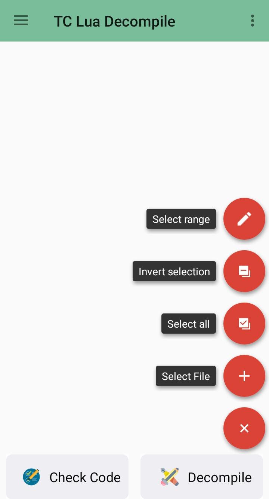
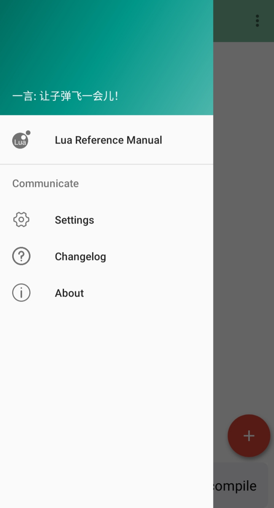
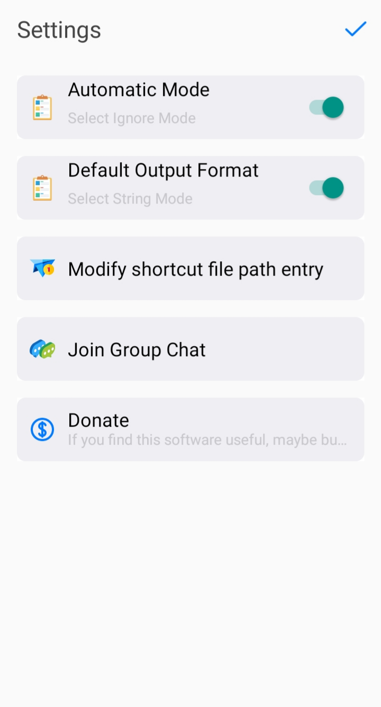

# TC Lua Decompile

This repo contains a decompiled, translated, and recompiled version of the [TDecompile](https://down.7po.com/downlist/39718.html) APK file.

<!-- Source:

- https://www.heishou.org/d/247305
- https://www.9k9k.com/app/80085.html
- https://m.5577.com/d/709685
- https://www.diyiyou.com/soft/9683.html
- https://down.7po.com/downlist/39718.html -->

> **Note**: Translated with [AI](https://en.wikipedia.org/wiki/Artificial_intelligence).

<br>

## Table of Contents

- [Screenshots](#screenshots)
- [Step-by-step: Decompile, Modify, and Sign APK](#step-by-step-decompile-modify-and-sign-apk)
  - [Prerequisites](#prerequisites)
  - [1. Decompile the APK](#1️⃣-decompile-the-apk)
  - [2. Modify APK](#2️⃣-modify-apk)
  - [3. Rebuild the APK](#3️⃣-rebuild-the-apk)
  - [4. Generate a Keystore (First Time Only)](#4️⃣-generate-a-keystore-first-time-only)
  - [5. Sign the APK](#5️⃣-sign-the-apk)
  - [6. Verify the Signed APK](#6️⃣-verify-the-signed-apk)

<br>

## Screenshots

<p align="center">
  
  
  
</p>

<br>

## Step-by-step: Decompile, Modify, and Sign APK

### Prerequisites

- [Java (JDK)](https://www.oracle.com/java/technologies/downloads/) and add to your system **PATH**.  
  Run the following commands to confirm: `java -version`
- [Apktool](https://apktool.org/docs/install) (latest version recommended to support your APK’s Android SDK)
- [Uber Apk Signer](https://github.com/patrickfav/uber-apk-signer?tab=readme-ov-file)

<br>

### 1️⃣ Decompile the APK

Use [Apktool](https://github.com/iBotPeaches/Apktool) to decompile the APK and extract resources.

Open terminal and run:

```bash
apktool d tdecompile_<VERSION>.apk -o tcld

# Replace <VERSION> with the actual APK version name (e.g. 1.3.1_276848)
# Example:
# apktool d tdecompile_1.3.1_276848.apk -o tcld
```

What it means:

- `d` → decode
- `-o tcld` → output folder for decompiled files
- After this, the folder `tcld/` will contain:

  - `assets/`
  - `build/`
  - `original/`
  - `res/`
  - `smali/`
  - `unknown/`
  - `AndroidManifest.xml`
  - `apktool.yml`

<br>

### 2️⃣ Modify APK

- Open `tcld/res/values/strings.xml` to translate Chinese text to English.
- Edit other resources as needed (menu, button, etc.).

<br>

### 3️⃣ Rebuild the APK

After modifications, rebuild using **Apktool**:

```bash
apktool b tcld -o tdecompile_<VERSION>_mod.apk

# Replace <VERSION> with the actual APK version name (e.g. 1.3.1_276848)
# Example:
# apktool b tcld -o tdecompile_1.3.1_276848_mod.apk
```

What it means:

- `b` → build
- `-o` → output APK filename

> At this stage, the APK is **rebuilt but unsigned**.

**Example file progression:**

```
tdecompile_1.3.1_276848.apk                 → original
tcld/                                       → decompiled folder
tdecompile_1.3.1_276848_mod.apk             → rebuilt (unsigned)
tdecompile_1.3.1_276848_mod-aligned-signed.apk → final signed APK
```

<br>

### 4️⃣ Generate a Keystore (First Time Only)

If you don’t have a **keystore** yet, generate one using [keytool](https://stackoverflow.com/q/4830253):

```bash
keytool -genkey -v -keystore tdecompile.keystore -alias tc_lua_decompile -keyalg RSA -keysize 2048 -validity 10000
```

What it means:

- `-genkey` → generate a new key pair
- `-v` → show detailed (verbose) output
- `-keystore tdecompile.keystore` → name of the keystore file
- `-alias tc_lua_decompile` → key name inside the keystore
- `-keyalg RSA` → encryption algorithm
- `-keysize 2048` → key strength
- `-validity 10000` → valid for about 27 years

You will be prompted to enter details, example:

```
Enter keystore password:  tdecompile
Re-enter new password:  tdecompile
Enter the distinguished name. Provide a single dot (.) to leave a sub-component empty or press ENTER to use the default value in braces.
What is your first and last name?
  [Unknown]:  Top Combine
What is the name of your organizational unit?
  [Unknown]:  dev
What is the name of your organization?
  [Unknown]:  TDecompile
What is the name of your City or Locality?
  [Unknown]:  China
What is the name of your State or Province?
  [Unknown]:  Beijing
What is the two-letter country code for this unit?
  [Unknown]:  CN
Is CN=Top Combine, OU=dev, O=TDecompile, L=China, ST=Beijing, C=CN correct?
  [no]:  yes
```

✅ Now you have a keystore `tdecompile.keystore` with alias `tc_lua_decompile`.

<br>

### 5️⃣ Sign the APK

1. Download the latest **Uber APK Signer** `.jar` file from [Releases](https://github.com/patrickfav/uber-apk-signer/releases/latest) page.
2. Save it in the same folder as your APK and keystore.
3. Open terminal and run:

   ```bash
   java -jar uber-apk-signer-<VERSION>.jar -a tdecompile_<VERSION>_mod.apk --ks tdecompile.keystore --ksAlias tc_lua_decompile --ksPass tdecompile --ksKeyPass tdecompile

   # Replace <VERSION> with the actual .jar/APK version name
   # Example:
   # java -jar uber-apk-signer-1.3.0.jar -a tdecompile_1.3.1_276848_mod.apk --ks tdecompile.keystore --ksAlias tc_lua_decompile --ksPass tdecompile --ksKeyPass tdecompile
   ```
<br>

After signing, the APK will be renamed, example:

```
tdecompile_1.3.1_276848_mod-aligned-signed.apk
```

<br>

### 6️⃣ Verify the Signed APK

(Optional but recommended):

```bash
java -jar uber-apk-signer-1.3.0.jar -a tdecompile_1.3.1_276848_mod-aligned-signed.apk --onlyVerify
```

You should see a **Verified** message.
